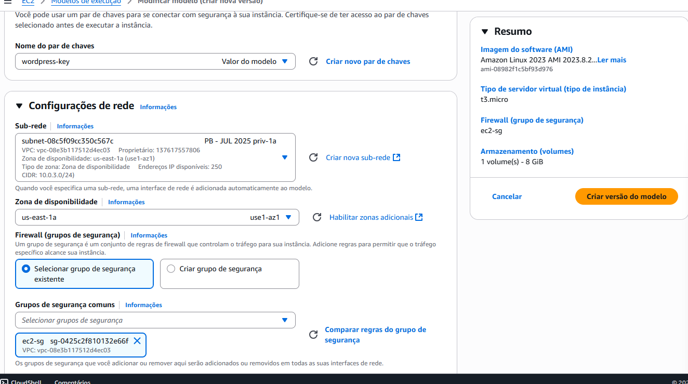
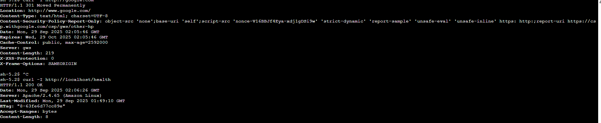
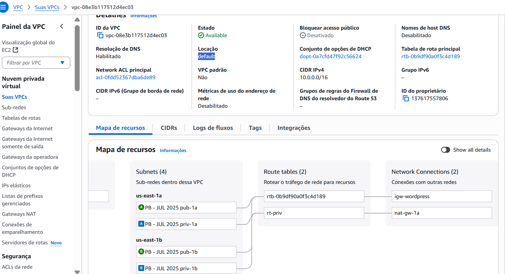
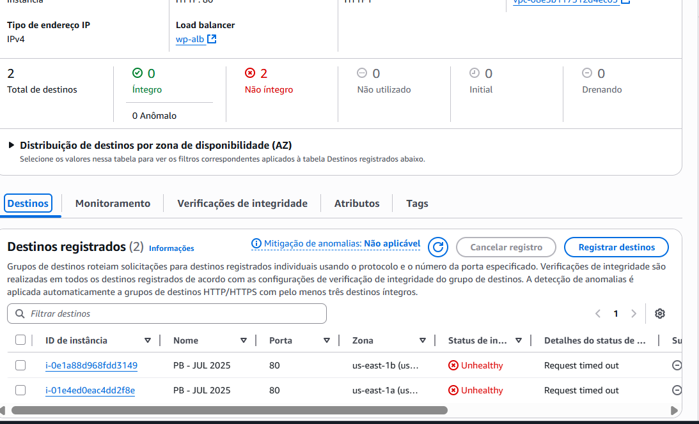

# tentativa-aws
Projeto AWS - WordPress em Alta Disponibilidade com Auto Scaling, Load Balancer e RDS
 🚀 WordPress em Alta Disponibilidade - AWS

## 📋 Projeto Real - Implementação Completa

## 📊 Evidências de Implementação

### 🛠️ Configuração Automática

*Script de user-data para deploy automático do WordPress*

### ✅ Testes de Funcionamento  

*Health check local 200 OK + Internet via NAT Gateway funcionando*

### 🌐 Infraestrutura de Rede

*VPC, subnets públicas/privadas, route tables e NAT Gateway*

### 🔴 Problema Identificado

*Health checks do ALB com "Request timed out" - Comunicação ALB→EC2*

## 🏗️ Arquitetura Implementada
Internet → ALB (Subnets Públicas) → Auto Scaling Group → EC2 (WordPress) → RDS MySQL → EFS

text

## 🛠️ User-Data Utilizado
```bash
#!/bin/bash
EFS_ID="fs-04bd960afba62cf94"
RDS_ENDPOINT="wordpress-db.c6bm0u0cg7s9.us-east-1.rds.amazonaws.com"
RDS_PASSWORD="SenhaSuperForte123!"

dnf update -y
dnf install -y httpd php php-mysqlnd php-gd php-mbstring wget amazon-efs-utils

mkdir -p /var/www/html
mount -t efs $EFS_ID:/ /var/www/html
echo "$EFS_ID:/ /var/www/html efs defaults,_netdev 0 0" >> /etc/fstab

cd /var/www/html
wget https://wordpress.org/latest.tar.gz
tar -xzf latest.tar.gz --strip-components=1
rm latest.tar.gz

cp wp-config-sample.php wp-config.php
sed -i "s/database_name_here/wordpressdb/g" wp-config.php
sed -i "s/username_here/admin/g" wp-config.php
sed -i "s/password_here/$RDS_PASSWORD/g" wp-config.php
sed -i "s/localhost/$RDS_ENDPOINT/g" wp-config.php

chown -R apache:apache /var/www/html
systemctl enable httpd
systemctl start httpd

echo "<html><body><h1>Healthy</h1></body></html>" > /var/www/html/health.html
